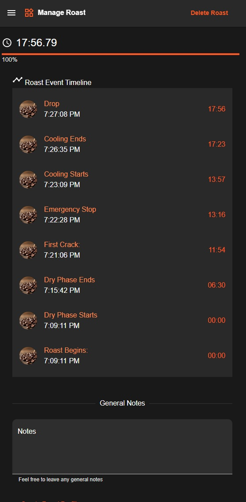

# The At Home Coffee Bean Roasting Application

### NOTE: A lot of this is constantly changing / in flux, development is not complete and is a continuous work in progress

The coffee bean roasting application is a dockerize project, which purpose is to assist home roasters (mainly myself but others are more than welcome to try it) with having their own free home roasting software. This is a constant work in progress, I am currently using it and iterating on it as time goes along at my leisure. The program allows you to:

1. Manage raw coffee beans that you want to roast
   - Tracks the origin of the bean, which is very commonly used in identifying quality beans in home roasting:
     1. Country
     2. Municipality
     3. Region

2. Manage roasting the raw coffee beans
   - Tracks how long you plan on roasting the bean
   - Tracks how close you are to hitting your target roast time
   - Tracks notes at intervals during the roasting process

### Upcoming:

1. Analytics
   - Figure out what coffee beans match certain flavor profiles based off of previous roasts
   - Figure out best time to roast, roast levels, and flavor profile based off of previous experiences

More or less, the more you use this software, the more powerful it becomes. You can use it to aggregate roasts to find what you're in the mood for, what coffee beeans you love but would be useful to make sure you have a variety of flavor profiles (on hand).

---

<p align="center" style="margin-top: 10px;">
   <br>
   <br>
   
   <br>
   <br>
   
   <br>
   <br>
</p>

---

# Implementation:

This a dockerized project that contains the following:

### 1. React (vanilla JS) driven front end

### 2. Django Rest Framework driven back end

### 3. pgsql database

Everything being dockerized simplified and streamlined development. This is a personal project, should only be installed on small at home networks.

# State of the project:

I'm using Trello to track tasks.
[View the Trello Board](https://trello.com/b/iGIpsjJx/coffee-roasting-app)

# Installation instructions:

1. Make sure you have docker installed on your system, wherever you want to run the program from.

2. Make sure docker is up and running, then running the following command (one time) to get everything installing. This will also start the program.

```bash
docker compose up --build
```
